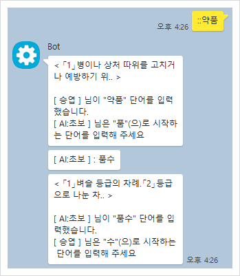

## 카카오톡 봇 끝말잇기 (미니게임)

카카오톡(또는 메신저) 봇에서 사용할 수 있는 한국 끝말잇기 게임입니다.

해당 코드는 라이노 엔진을 사용하는 자바스크립트에서 동작하도록 작성되었습니다.

### 작동 사진

### 업데이트 목록
자세한 내용을 보고 싶다면 "https://blog.naver.com/ttyy3388" 블로그를 이용해주세요.

### 사용 및 적용 방법
해당 코드를 복사하여 기능을 동작시킬 봇 소스에 붙여넣기 한 후 컴파일하면 됩니다.

### 라이선스 적용
게임에서 사용하는 모든 단어와 관련된 정보(데이터)는 표준국어대사전(이하 표국대)의 단어를 내려받아 사용합니다.

또한 해당 소스는 깃허브에 명시된 것과 같이 "GPL-3.0" 라이선스를 적용합니다.

(Licensed under the "GPL-3.0" license.)